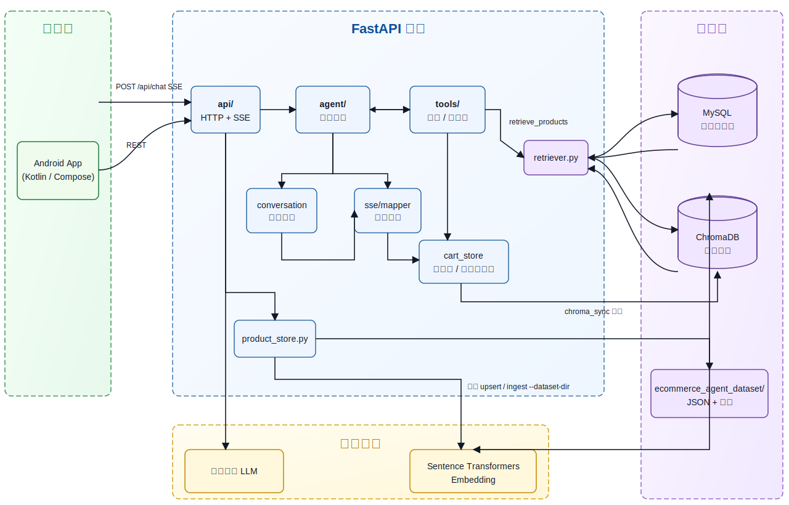
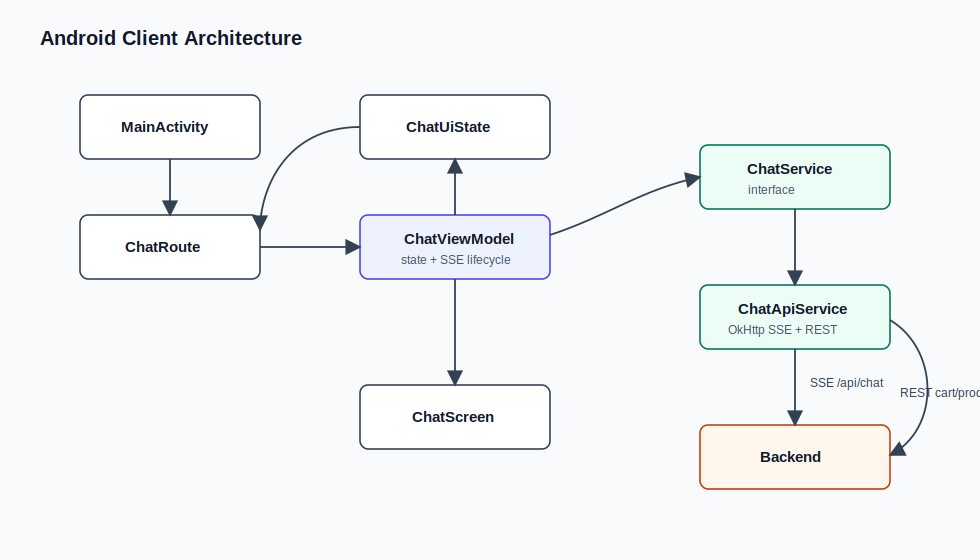
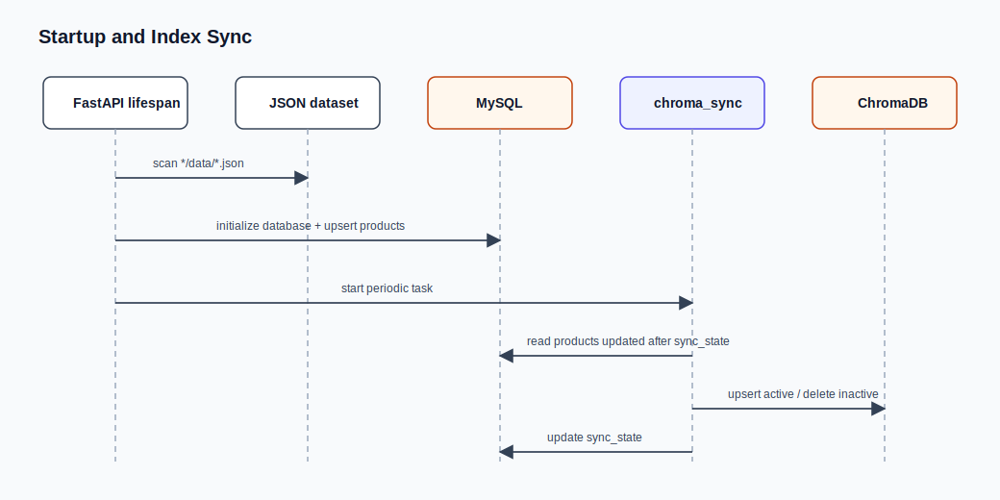
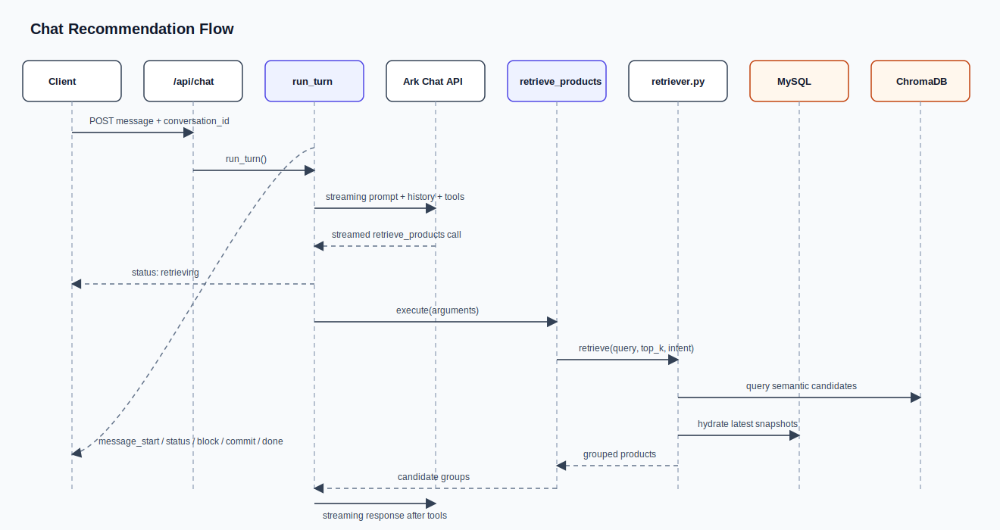
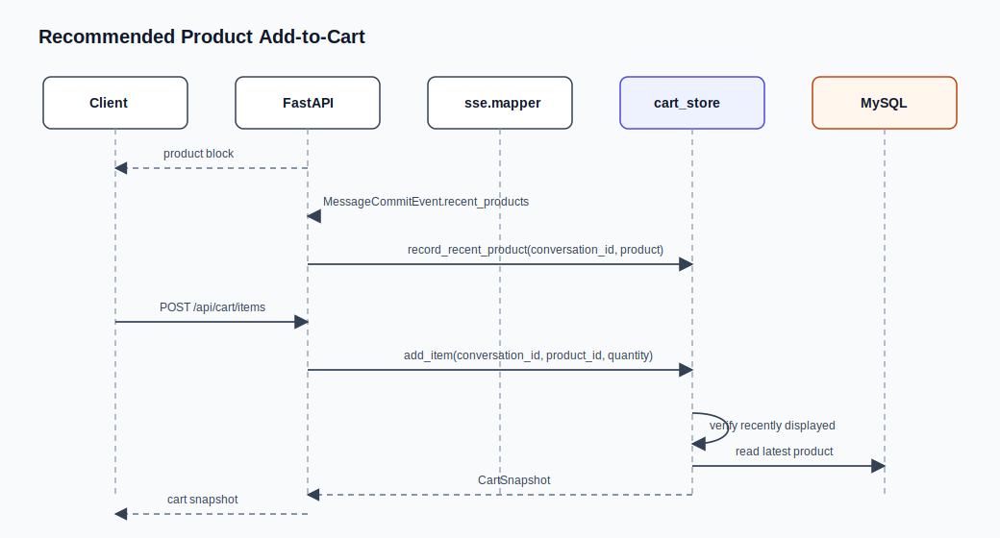

# Architecture

本文档基于当前源码描述 EcommerceAgent 的系统结构、模块职责和主要数据流。

## 总览

EcommerceAgent 由四部分组成：

- 后端服务：`server/`，FastAPI + SSE，负责会话、Agent 编排、RAG 检索、商品详情和购物车。
- 移动客户端：`client-android/`，Kotlin + Jetpack Compose，负责聊天 UI、商品卡片、商品详情和购物车交互。
- 数据集：`ecommerce_agent_dataset/`，按类目组织的商品 JSON 和图片。
- 评估工具：`eval/`，用于离线评估商品召回效果。

## 运行时边界

### FastAPI 入口

位置：`server/main.py`

`create_app()` 创建 `FastAPI(title="EcommerceAgent API")`，挂载：

- CORS：允许所有来源、方法和请求头。
- 静态资源：`/assets` 指向 `ecommerce_agent_dataset/`。
- 健康检查：`GET /health`。
- 业务路由：通过 `api.include_api_routes(app)` 注册聊天、商品、购物车路由。

应用 lifespan 执行两个启动任务：

1. `product_store.load_dataset_to_mysql()`：把数据集 JSON 幂等写入 MySQL。
2. `asyncio.create_task(chroma_sync.run_periodic_sync())`：启动 ChromaDB 后台增量同步。

### 商品权威源与语义索引

MySQL 是商品权威源，ChromaDB 是可重建的语义索引。

- `server/product_store.py`
  - 定义 `products` 与 `sync_state` 表。
  - 创建数据库和表。
  - 把数据集商品转成 MySQL 记录。
  - 提供商品快照、详情、活跃商品列表、同步状态读写。
- `server/ingest.py`
  - 解析数据集 JSON。
  - 构造 `embedding_text` 和完整商品文档。
  - 从 MySQL 上架商品构建或 upsert ChromaDB collection。
- `server/chroma_sync.py`
  - 读取 `products.updated_at > last_sync_at` 的变更。
  - 上架且有库存的商品 upsert 到 ChromaDB。
  - 下架商品从 ChromaDB 删除。
  - 同步进度写回 `sync_state`。

设计约束：

- 价格、库存、上下架状态不依赖 Chroma 文档，检索后从 MySQL 实时补全。
- Chroma metadata 保存稳定字段，如 `product_id`、标题、品牌、类目、图片。
- 商品详情响应不暴露完整 `raw_payload`。

## 后端模块职责

### `server/api/`

HTTP 层保持薄封装：

- `chat.py`：`POST /api/chat`，把 Agent 事件映射为 SSE。
- `products.py`：`GET /api/products/{product_id}`，读取公开商品详情。
- `cart.py`：购物车 REST API，转换 `CartOperationError` 为 HTTP 错误。
- `__init__.py`：统一注册路由。

### `server/agent/`

Agent 层把图装配、模型运行、工具运行和内部协议分开，负责工具调用、最终回复流式解析和可恢复错误处理。

- `graph.py`：`run_turn()` 入口、状态初始化和图/路由装配；运行时通过显式 step driver 消费事件，避免依赖框架 recursion limit 终止。
- `runtime.py`：模型 step、完整 LLM stream 超时、turn budget、force-final 终止策略。
- `tool_runtime.py`：tool call chunk 后的参数解析、工具执行和工具结果整理。
- `contracts.py`：Agent 内部 typed contracts，如 `CandidateGroup`、`CandidateProduct`、`ToolCall`、`RecentProductEntry`、`AgentState`、`TurnBudget`。
- `prompts.py`：工具调用规则、移动端短回复规则、隐藏结构化标记格式。
- `events.py`：内部事件和解析结果 dataclass。
- `streaming.py`：流式解析 `<R>` 推荐标记，及时发出商品块和文本增量。
- `emitters.py`：把解析结果转换成 block 事件，并写入对话历史。
- `parsing/`：校验 `<R>` 推荐、`<C>` 对比、移动端可见文本约束。
- `errors.py`：`RecoverableAgentError`、`AgentRecoveryExhausted`、`RecoveryState`。
- `candidates.py`：候选商品分组格式化与 group 校验辅助。

关键策略：

- 单轮最多执行 `MAX_TOOL_STEPS = 5` 个工具步骤。
- `TurnBudget` 同时限制模型 step、工具 step 和状态迁移次数；预算耗尽会抛 `AgentRecoveryExhausted`。
- force-final 只允许尝试一次；如果模型在 force-final 后仍产生工具调用，本轮直接终止。
- LLM 单次调用超时为 `LLM_TIMEOUT_SECONDS = 60`。
- 同类可恢复错误最多重试 2 次，总恢复次数最多 6 次。
- 首轮模型调用使用 streaming tool-calling：先出现正文则立即以 provisional attempt 输出；若随后出现工具调用，发 `message_reset` 后执行工具。
- 最终可见回复限制为移动端短文本，禁止 Markdown 表格、标题等重格式。
- 推荐商品必须使用 `<R>` 标记引用本轮工具候选商品 ID。
- 基于历史商品做对比时使用 `<C>{...}</C>` 结构化对比标记。

### `server/tools/`

LLM 工具注册表。

- `retrieve_products.py`
  - 定义 `retrieve_products` 工具 JSON schema。
  - 支持 `requests` 批量检索子需求。
  - 将 `search_query`、类目、价格、must/exclude terms 转为 retriever intent。
  - `parse_intent()` 供离线评估通过强制工具调用抽取检索意图。
- `cart.py`
  - 定义购物车工具：`add_to_cart`、`list_recent_products`、
    `remove_from_cart`、`update_cart_item`、`view_cart`、`clear_cart`。
  - 将自然语言指代解析成确定性购物车操作。
- `__init__.py`
  - 合并工具定义。
  - 分发工具执行；购物车工具必须传入 `conversation_id`。

### `server/retriever.py`

RAG 检索链路：

1. 从 ChromaDB collection 读取候选，候选数量为 `min(max(limit * 6, 30), count)`。
2. 如果 intent 包含类目或排除品牌，构造 Chroma `where` filter。
3. 如果 filter 查询无结果，回退到无 filter 查询。
4. 对候选进行 rerank：
   - 向量距离权重 `_VECTOR_WEIGHT = 0.7`。
   - must-have 命中权重 `_MUST_TERM_WEIGHT = 0.3`。
   - exclude terms 在商品正文和用户评价中命中会产生衰减惩罚。
5. 根据 product_id 从 MySQL 补全最新商品快照。
6. 过滤下架、无库存、类目不符、排除品牌、价格区间不符的商品。

### `server/cart_store.py`

进程内购物车与近期展示商品池。

- `_carts`：`conversation_id -> product_id -> quantity/last_seen_price`。
- `_recent_product_entries`：每个会话最多保存 20 个最近展示商品。
- 加购必须满足：
  - 商品在当前会话近期展示商品池中。
  - 商品存在、上架、有库存。
  - 加购后数量不超过库存。
- `snapshot()` 每次从 MySQL 重新 hydrate 商品，移除已不存在或下架商品，并提示价格变化。

### `server/sse/mapper.py`

把 Agent 内部事件转换成客户端消费的 SSE 事件。

重要细节：

- `sse.mapper` 只做协议映射，不写业务状态。
- `BlockProductEvent` 只映射商品块，不记录近期商品。
- `api.chat.iter_chat_sse_events()` 在处理 `MessageCommitEvent.recent_products` 时记录近期展示池。
- 这样可以避免失败重试过程中的临时商品卡被错误允许加购。

### `server/catalog/product_presenter.py`

商品公开字段派生层。

- `product_card_payload()`：生成聊天卡片和详情页共享字段。
- `build_product_detail()`：在卡片字段基础上追加描述、规格、FAQ、评价摘要。
- `product_availability()`：把 `is_active` 和 `stock` 转为
  `in_stock`、`low_stock`、`out_of_stock`、`inactive`。

## 客户端架构

位置：`client-android/`

### 网络层

`data/api/ChatApiService.kt` 实现 `ChatService`：

- `streamChat()`：使用 OkHttp SSE 消费 `/api/chat`。
- `getCart()`、`addCartItem()`、`updateCartItem()`、`removeCartItem()`、`clearCart()`：
  调用购物车 REST API。
- `getProductDetail()`：读取商品详情。
- 相对图片和 API URL 会基于 `BuildConfig.API_BASE_URL` 补全为绝对 URL。

### 状态层

`viewmodel/ChatViewModel.kt`：

- 维护 `ChatUiState`。
- 生成本地 `conversationId`。
- 管理 SSE 消息生命周期、attempt 重试、增量文本、商品块和对比块。
- 处理取消回复、商品详情弹层和购物车操作。

### UI 与模型

- `ui/chat/ChatScreen.kt`：聊天主界面。
- `data/model/Message.kt`：消息块模型，包含文本、商品、对比块。
- `data/model/Product.kt`：商品卡片和详情模型。
- `data/model/Cart.kt`：购物车模型。
- `data/model/CompareTable.kt`：对比表模型。

## 核心数据流

### 启动与索引同步

### 聊天推荐

### 推荐商品加购

## 数据模型与存储

### 商品数据集

每个商品 JSON 包含：

- `product_id`、`title`、`brand`、`category`、`sub_category`
- `base_price`、`stock`、`skus`
- `rag_knowledge.marketing_description`
- `rag_knowledge.official_faq`
- `rag_knowledge.user_reviews`

图片位于同类目的 `images/` 目录，后端通过 `/assets/{category}/images/{product_id}_live.jpg`
暴露。

### MySQL

`products` 表保存：

- 商品稳定字段：ID、标题、品牌、类目、子类目、图片。
- 易变字段：价格、库存、上下架。
- 文本字段：`description`、`embedding_text`、`raw_payload`。
- 时间字段：`created_at`、`updated_at`。

`sync_state` 表保存 Chroma 增量同步水位。

### ChromaDB

collection 名称由 `CHROMA_COLLECTION_NAME` 配置，默认 `products`。

每条记录：

- `id`：`product_id`
- `embedding`：`embedding_text` 的 SentenceTransformer embedding
- `document`：完整商品说明，供 LLM 阅读
- `metadata`：商品 ID、标题、品牌、类目、子类目、图片 URL

## 错误与恢复

Agent 把以下错误视为可恢复，并反馈给 LLM 修正：

- 工具参数不是合法 JSON。
- 工具执行失败。
- LLM 输出未知候选商品 ID。
- 推荐或对比隐藏标记格式不合法。
- 可见回复过长或包含禁止的 Markdown 结构。
- LLM 调用超时或响应为空。

当同类错误超过 `MAX_RECOVERY_RETRIES` 或总恢复次数超过
`MAX_TOTAL_RECOVERY_ATTEMPTS` 时，本轮抛出 `AgentRecoveryExhausted`，
SSE 返回通用错误事件。

## 当前限制

- 会话历史、购物车、近期展示商品池都是进程内内存状态，不适合多实例共享。
- `conversation_id` 由客户端生成或请求传入，服务端 SSE 不回传新的会话 ID。
- 启动时会扫描完整数据集并 upsert MySQL，数据量增大后需要拆分为独立导入流程。
- ChromaDB 使用本地持久化目录 `server/chroma_db`，没有远程向量库部署配置。
- Android API 基址是构建期常量，需要联调前手动修改。
