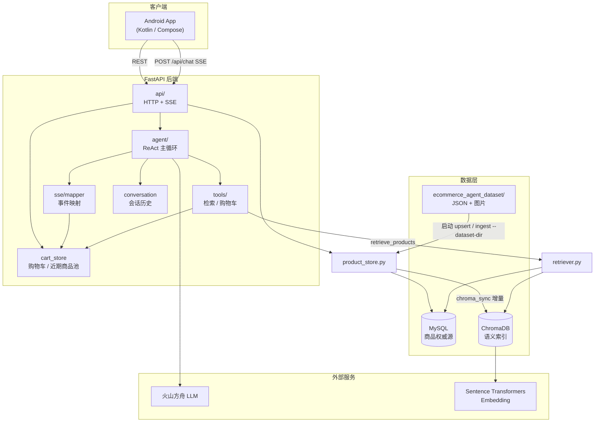
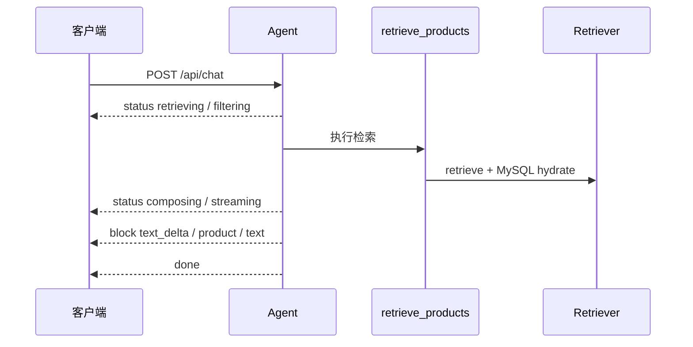

# 架构设计

本文档描述 EcommerceAgent 的系统边界、模块职责与核心数据流。接口细节见 [api_index.md](api_index.md)。

## 1. 系统概览



## 2. 分层职责

### 2.1 接入层（`server/api/`）

| 模块 | 职责 |
|------|------|
| `chat.py` | 接收用户消息，驱动 Agent 一轮对话，经 SSE 推送事件流；客户端断开时取消 LLM |
| `products.py` | 商品详情 REST 查询 |
| `cart.py` | 购物车 CRUD REST 接口 |

`main.py` 生命周期：启动时 `load_dataset_to_mysql()`、挂载 `/assets` 静态文件、启动 `chroma_sync.run_periodic_sync()`（180 秒间隔）。

### 2.2 Agent 编排层（`server/agent/`）

**ReAct 工具循环**（`loop.py`）：

1. 用户消息写入 `conversation`，携带 `SYSTEM_PROMPT` 调用 LLM（temperature=0.3，超时 60s）。
2. LLM 返回工具调用 → 执行工具，结果写回 `messages`，继续循环（最多 **5 步**，`MAX_TOOL_STEPS`）。
3. 任意工具执行后都回到 ReAct 循环，允许同一用户请求内串联检索、删除、改量等复合操作。
4. LLM 不再请求工具，或工具步数达到上限后，进入**流式**最终回复（`StreamingFinalEmitter`），解析 `<R>` / `<C>` 标记。

**最终回复两条路径**：

| 路径 | 触发 | 行为 |
|------|------|------|
| 流式 | LLM 不再请求工具，或工具步数达到上限 | 边收 LLM token 边解析，产出 `text_delta` / `product` block |
| 非流式 | 内部测试/兼容路径 | `parse_final_response` 一次性解析，经 `events_from_parsed_response` 产出 block |

最终回复不再因调用过 `retrieve_products` 而强制输出 `<R>`：模型只有在决定推荐工具候选商品时才输出 `<R>`。候选为空、候选明显不符合需求或无法确认匹配度时，可输出普通短文本，不产生商品卡片。服务端只校验显式输出的隐藏标记是否合法，且 `<R>` / `<C>` 必须是首个非空内容。

**推荐 block 顺序**（非流式与流式一致）：`intro 文本` → 每个商品的 `product 卡片` + `reason 文本` → `outro 文本`。

最终回复采用 provisional SSE 生命周期：每次尝试先推送 `message_start(message_id, attempt_id)`，临时输出 `block`；若解析失败，推送 `message_reset` 后用同一 `message_id` 和新的 `attempt_id` 重试；解析成功后推送 `message_commit`。客户端按 `message_id + attempt_id` 覆盖临时内容。

**可恢复错误**（`errors.py`）：

- 工具 JSON 非法、推荐/对比标记格式错误、可见正文超长或含 Markdown 等 → 注入 system feedback 重试。
- 同类错误最多重试 **2 次**（`MAX_RECOVERY_RETRIES`），总恢复次数上限 **6 次**（`MAX_TOTAL_RECOVERY_ATTEMPTS`）。
- 超限抛出 `AgentRecoveryExhausted`，SSE 推送 `error` 事件。

**移动端输出约束**（`parsing/mobile.py` + `constants.py`）：

- 可见正文 ≤ **120** 字（`MOBILE_VISIBLE_REPLY_MAX_CHARS`）。
- 禁止 Markdown 标题、加粗、表格、分隔线。
- 推荐标记字段上限：INTRO 40 字、REASON 45 字、OUTRO 40 字。

关键子模块：

| 模块 | 职责 |
|------|------|
| `loop.py` | 主循环、工具调度 |
| `llm.py` | LLM 调用、流式最终回复、取消/超时处理 |
| `streaming.py` | 流式 `<R>` / `<C>` 解析，`text_delta` 按 CJK 单字/非 CJK 3 字符切分 |
| `parsing/` | 推荐/对比/标记语法校验 |
| `emitters.py` | 非流式解析结果 → block 事件 |
| `prompts.py` | 系统提示词 |
| `candidates.py` | 工具候选格式化（含完整 document，用于当前轮次与会话历史） |

### 2.3 工具层（`server/tools/`）

| 工具 | 说明 |
|------|------|
| `retrieve_products` | 1–4 个检索子需求 → `retriever.retrieve()` |
| `add_to_cart` | 批量加购，需明确 `product_ids` |
| `remove_from_cart` / `update_cart_item` | 支持 `product_id`、`cart_position`（1-based）、`title_keyword` |
| `view_cart` / `clear_cart` | 查看 / 清空 |
| `list_recent_products` | 本会话近期展示商品（最多 20），仅用于消解指代 |

### 2.4 检索层（`server/retriever.py`）

1. **向量召回**：ChromaDB，`n_results = min(max(top_k×6, 30), count)`。
2. **元数据过滤**：类目、排除品牌写入 `where`；无结果时 fallback 无 filter 重查。
3. **重排**：向量 70% + 必选词命中 30% − 排除词惩罚（negation-aware）。
4. **MySQL hydrate**：补全价格/库存，过滤下架/缺货/价格区间。

### 2.5 数据层

#### MySQL（权威源）

`product_store.py`：

- 启动时扫描 `ecommerce_agent_dataset/*/data/*.json` 幂等 upsert。
- `ingest.py --dataset-dir` 也可触发同样 upsert。
- `sync_state` 表记录 Chroma 增量同步水位。

#### ChromaDB（语义索引）

- 目录：`server/chroma_db/`，collection 默认 `products`。
- 存储：`embedding_text` 向量、`description` 文档、稳定 metadata。
- **不含**价格、库存、上下架。

`ingest.py` 从 MySQL `list_active_products()` 构建索引；`chroma_sync.py` 后台增量 upsert/删除。

#### 内存状态

| 存储 | 模块 | 说明 |
|------|------|------|
| 会话历史 | `conversation.py` | 最多 10 轮 user 消息；工具调用与完整 tool 结果（含 document）也写入 |
| 购物车 | `cart_store.py` | 按 `conversation_id` 隔离 |
| 近期展示商品池 | `cart_store.py` | 最终回复 `message_commit` 时写入已提交的 product block；加购前置条件 |

购物车 hydrate 时会：自动移除已下架/已删除商品、检测**价格变动**并写入 `CartSnapshot.messages`。

> 会话与购物车为进程内存，重启丢失。

### 2.6 展示层

- `catalog/product_presenter.py`：派生 `stock_status`、`highlights`、`detail_url`（`/api/products/{id}`）、详情页 specs/faq/review_summary。
- `sse/mapper.py`：Agent 事件 → SSE（`message_start` / `message_reset` / `message_commit` / `status` / `block` / `cart` / `done` / `error`）。

### 2.7 Android 客户端

- `ChatViewModel` 本地生成 `conversationId`，全链路携带。
- `ChatApiService` 使用 `BuildConfig.API_BASE_URL`（在 `app/build.gradle.kts` 配置，**非**硬编码 `10.0.2.2`）。
- 相对路径图片/API URL 拼成绝对地址；支持取消 SSE、商品详情弹层、购物车 REST 操作。

## 3. 核心流程

### 3.1 商品推荐



### 3.2 购物车

- **对话**：Agent 调用购物车工具 → `CartEvent` → SSE `cart`。
- **REST**：`/api/cart/*` 与 Agent 共享 `cart_store`。
- **加购约束**：商品须在近期展示池中（404）；库存不足/下架返回 409。

### 3.3 数据导入与同步

```text
首次部署
  └─ python ingest.py --dataset-dir ../ecommerce_agent_dataset
       ├─ load_dataset_to_mysql()
       └─ list_active_products() → ChromaDB 全量 upsert

服务运行中
  ├─ 启动：load_dataset_to_mysql()（幂等）
  └─ 后台：chroma_sync 每 180s 增量同步
```

## 4. 关键设计决策

### 4.1 MySQL 作为商品权威源，Chroma 只做语义召回

商品价格、库存、上下架状态和详情页 payload 以 MySQL 为准；Chroma 只保存 `embedding_text`、`description` 和稳定 metadata，用于向量召回。这样可以避免把价格、库存这类高频变化字段固化进向量库，减少重建索引成本。

影响：

- 检索链路必须在 Chroma 召回后执行 MySQL hydrate，再过滤下架、缺货和价格区间。
- Chroma 结果不能直接返回给客户端；所有可见商品卡片都必须经过 `product_store.product_card_payload()`。
- 增量同步只负责把可检索文本和稳定 metadata 写入 Chroma，商品实时状态仍在 MySQL 查询阶段裁决。

### 4.2 启动幂等导入 + 后台增量同步

服务启动时执行 `load_dataset_to_mysql()`，保证本地数据集和 MySQL 至少处于可服务状态；`chroma_sync` 每 180 秒按 `sync_state` 水位同步到 Chroma。这让开发和演示环境可以少依赖人工初始化步骤，同时避免每次启动都全量重建向量库。

影响：

- 数据集 JSON 是初始数据来源，MySQL 是运行期权威源。
- `products.updated_at` 只有在核心字段变化时才推进，避免无意义触发 Chroma 同步。
- 如果向量库为空，检索应失败并提示先运行 `python ingest.py`，而不是返回空推荐掩盖环境问题。

### 4.3 ReAct 循环限制在 5 步，并强制工具后回到模型决策

Agent 采用“模型决策 → 工具执行 → 工具结果回填 → 模型继续决策”的 ReAct 主循环，同一轮最多执行 5 个工具步骤。这样既支持“先检索、再比较、再加购/改购物车”的复合意图，又能限制模型反复调用工具造成的延迟和成本。

影响：

- 每个工具结果都会写入当前轮 `messages`，成功工具调用也会进入会话历史，后续多轮可引用商品 document。
- 达到工具步数上限后，系统会要求模型基于已有工具结果直接回复；信息仍不足时应追问用户。
- 工具异常会被转成可恢复反馈，交给模型修正参数或表达，而不是直接终止整轮对话。

### 4.4 隐藏标记承载 UI 结构，客户端只消费 SSE block

最终回复使用 `<R>` 推荐块和 `<C>` 对比块表达结构化内容，客户端不解析大段自然语言来识别商品卡片。模型负责输出受约束的隐藏标记，服务端解析后发出 `text_delta`、`product`、`compare` 等 block。

影响：

- 服务端不强制调用过 `retrieve_products` 后必须输出 `<R>`；只有显式 `<R>` 会生成商品卡片。模型可在候选为空或不匹配时输出普通短文本，但不能在普通文本后再追加隐藏标记。
- 商品 ID 必须来自本轮候选集，防止模型捏造不存在或未检索到的商品。
- 可见正文受移动端长度和格式约束，不允许 Markdown 表格、标题、加粗等不稳定展示形态。

### 4.5 流式解析推荐标记，让商品卡片尽早出现

推荐回复不等完整 LLM 输出结束再解析，而是在流中识别 `<ITEM id="...">` 后立即发出商品卡片，再继续流式输出推荐理由。这样降低首个可见内容和首张商品卡片的等待时间，移动端也能更快渲染可交互内容。

影响：

- `StreamingFinalEmitter` 必须维护推荐块状态机，严格校验标签顺序、嵌套和闭合。
- 文本 delta 按 CJK 单字、非 CJK 3 字符切分，兼顾中文流式观感和事件数量。
- 一旦流式解析发现非法标记，会抛出可恢复错误，让模型重试生成；客户端先显示的 provisional 内容会在 `message_reset` 后被清空或覆盖。

### 4.6 近期展示商品池是加购安全边界

加购只允许针对当前 `conversation_id` 下近期 SSE 推送过的商品，商品池最多保留 20 个，并按展示时间去重更新。这个限制把“模型认为用户想买什么”和“用户实际看到了什么”绑定起来，降低误加购、跨会话串货和模型幻觉商品 ID 的风险。

影响：

- `map_block_product_event()` 只负责推送临时商品卡片；`message_commit` 时才把已提交商品写入近期展示商品池。
- `add_to_cart` 必须接收明确 `product_ids`；如果需要消解历史指代，可以调用 `list_recent_products`，但用户表达含糊时应先追问。
- REST 加购和 Agent 加购共享同一个池与购物车状态，因此客户端操作和对话操作具备一致约束。

### 4.7 购物车按会话隔离，但商品状态实时 hydrate

购物车当前使用进程内存按 `conversation_id` 隔离，保存 `product_id`、数量和上次展示价格；每次读取快照时再从 MySQL hydrate 最新商品信息。这样实现简单，适合当前单进程演示和移动端联调，同时保持价格、库存、上下架状态的实时性。

影响：

- 服务重启会丢失会话历史、购物车和近期商品池；生产化需要替换为持久化存储。
- 快照读取会自动移除已删除/下架商品，并在价格变化时写入 `messages` 提醒客户端。
- 库存校验发生在加购和改数量时；读取快照仍会保留库存不足商品，并通过 `unavailable_reason` 提示。

### 4.8 客户端持有 `conversation_id`

服务端接受客户端传入的 `conversation_id` 并按需创建会话，但 SSE 流不负责回传 ID，也没有单独的会话创建 API。移动端本地生成并持久化 ID，聊天、购物车 REST 和近期商品池都复用这一标识。

影响：

- 客户端取消 SSE 后仍可用同一个 ID 继续请求购物车或发起下一轮对话。
- 服务端无需维护会话生命周期 API，降低接口面；代价是客户端必须保证 ID 稳定传递。
- 若客户端省略 ID，服务端可生成临时 ID，但客户端无法从 SSE 得知它，实际多轮体验会退化。

### 4.9 可恢复错误只覆盖模型可修正的问题

系统不会用宽泛 `try-except` 吞掉所有异常；只有工具 JSON 非法、推荐标记不合规、可见正文越界、工具参数可修正等问题会转为 `RecoverableAgentError` 并反馈给模型重试。数据库连接、缺少 API Key、向量库为空等环境或系统错误应快速失败。

影响：

- 同类错误最多重试 2 次，总恢复次数最多 6 次，防止模型陷入无限修正。
- 恢复反馈作为 system message 注入当前轮，不污染长期会话历史。
- 恢复耗尽后由 SSE 映射为稳定的用户可见错误消息，服务端日志保留真实异常上下文。

### 4.10 客户端断开时取消 LLM，未提交内容不入历史

聊天接口基于 SSE 推送，客户端断开后服务端会取消正在进行的 LLM 调用，不再发送 `done`。最终回复只有在解析成功并 `message_commit` 后写入会话历史；未提交的 provisional 输出不会进入历史。

影响：

- 取消请求可以减少无用 token 消耗和后台任务堆积。
- 后续对话能知道上一轮回复只完成了一部分，避免把半截回答当成完整结论。
- 客户端不能依赖断开场景下收到 `done`，需要以连接关闭作为取消完成信号。

## 5. 模块依赖

```text
main.py
 ├── product_store ── ingest（文本构建）
 ├── chroma_sync ──── product_store, ingest, embedding
 └── api/
      ├── chat ────── agent, conversation, sse.mapper
      ├── products ── product_store, catalog
      └── cart ────── cart_store, conversation

agent/loop → tools → retriever → product_store, chroma, embedding
```

## 6. 扩展点

- **持久化会话/购物车**：替换 `conversation.py`、`cart_store.py` 内存 dict。
- **多模态检索**：课题规划能力，当前未实现；可在工具层增加图像理解 → 视觉 query。
- **离线评估**：`tools/retrieve_products.parse_intent()` 供 eval 脚本调用（`eval/` 未纳入版本库）。
